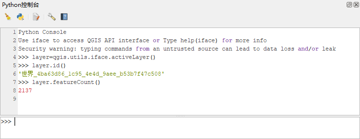

# 1 引言

本文档既可作为教程，也可作为参考指南。虽然没有列举所有可能的案例，但是对主要功能有一个很好的概述。

对于Python的支持最初是在QGIS 0.9中引入的。 目前，在QGIS桌面版中有几种方法可以使用Python，如下：

- 在QGIS的Python控制台中
- 创建并使用插件
- QGIS启动时自动运行Python代码
- 创建处理算法
- 在QGIS中为表达式创建函数
- 基于QGIS API创建自定义应用程序

Python支持在QGIS 0.9中首次引入。这里有几种方法可以在QGIS桌面软件中使用Python（涵盖一下部分）：

- 在QGIS中的Python控制台中使用命令
- 创建并使用插件
- 当QGIS启动时自动运行Python代码
- 创建处理算法
- 在QGIS中创建函数表达式
- 基于QGIS API创建自定义应用

Python绑定也可用于QGIS服务，包括Python插件（请参阅[20-QGIS Server Python](20-QGIS服务和Python.md)）和Python绑定，可用于将QGIS服务嵌入到Python应用程序中。
这里有一个[完整的QGIS C++ API](<https://qgis.org/api/>)参考——用于记录QGIS库中的类。 [Pythonic QGIS API（pyqgis）](https://qgis.org/pyqgis)几乎与C ++ API相同。
学习执行常见任务的另一个好办法是从[插件仓库](https://plugins.qgis.org/)下载现有插件并学习它们的代码。

## 1.1 在Python控制台中编写脚本

QGIS为脚本编写提供了一个集成的python控制台。可以从插件→python控制台菜单中打开：



上面的截图说明了如何获取图层列表中当前选定的图层，并显示其ID，如果是矢量图层，还可以显示要素个数。对于与QGIS交互环境，有一个`iface`变量，它是[QgisInterface](https://qgis.org/pyqgis/master/gui/QgisInterface.html#qgis.gui.QgisInterface)的一个实例。此接口允许访问地图画布、菜单、工具栏和QGIS应用程序的其他部分。

为了方便用户，在启动控制台时将会执行以下语句（将来可以设置更多的初始命令）

```python
from qgis.core import *
import qgis.utils
```

对于经常使用控制台的用户，设置打开控制台的快捷键可能很有用（在设置→键盘快捷键中...）

## 1.2 Python插件

可以使用插件来扩展QGIS的功能，可以使用Python编写插件。与C ++插件相比，主要优点是分发简单（不对每个平台进行编译）、更容易的开发。

自从引入对Python的支持以来，已经编写了许多涵盖各种功能的插件。插件安装程序允许用户很容易获取、升级和删除Python插件。有关插件和插件开发的更多信息，请参阅[Python插件](https://plugins.qgis.org/)页面。

使用Python创建插件很简单，详细说明请参阅[16-开发Python插件](16-开发Python插件.md)。

!!! 提示
    Python插件也可用于QGIS服务，更多信息，请参阅[20-QGIS Server Python](20-QGIS服务和Python.md)。

### 1.2.1 处理插件

处理插件可被用于处理数据。它们比Python插件更容易开发、更具体、更轻量。[17-编写处理插件](17-编写处理插件.md)阐述了什么时候该使用处理算法，并且怎么开发它们。


## 1.3 QGIS启动时运行Python代码

每次QGIS启动时，都有两种不同的方法来运行Python代码。

1. 创建startup.py脚本
2. 将`PYQGIS_STARTUP`环境变量设置为现有Python文件

### 1.3.1 startup.py文件

每次QGIS启动时，用户的Python主目录都会在以下目录搜索名为`startup.py`的文件。 如果该文件存在，则由嵌入式Python解释器执行。

- Linux： `.local/share/QGIS/QGIS3`
- Windows： `AppData\Roaming\QGIS\QGIS3`
- macOS： `Library/Application Support/QGIS/QGIS3`

!!! 提示
    默认路径取决于操作系统。要查找适合你的路径，打开Python控制台，并运行`QStandardPaths.standardLocations(QStandardPaths.AppDataLocation)` 查看默认目录列表。

### 1.3.2 PYQGIS_STARTUP环境变量

你可以在QGIS初始化完成之前将`PYQGIS_STARTUP`环境变量设置为现有Python文件的路径来运行Python代码。

此代码将在QGIS初始化完成之前运行。此方法对于清理sys.path非常有用——可能存在不需要的路径，或用于隔离/加载初始环境——无需虚拟环境，例如在Mac上使用homebrew或MacPorts。

## 1.4 Python应用程序

为自动化流程创建脚本通常很方便。使用PyQGIS，这是完全可能的——导入`qgis.core`模块，初始化它，你就可以进行处理了。

或者你可能想要创建一个使用GIS功能的交互式应用程序——执行测量、将地图导出为PDF或任何其他功能。`qgis.gui`模块提供了各种GUI部件，最值得注意的是可以合并到应用程序中的地图画布控件——支持缩放，平移和任何其他自定义地图工具。

必须配置PyQGIS自定义应用程序或独立脚本以定位QGIS资源，例如投影信息，用于读取矢量和栅格图层的数据提供者等。QGIS资源通过在应用程序或脚本的开头添加几行（代码）来初始化。自定义应用程序和独立脚本初始化QGIS的代码类似。以下提供各自的实例。

!!! 提示
    千万不能使用`qgis.py`作为你的测试脚本的名称，否则Python将无法导入绑定。

### 1.4.1 在独立脚本中使用PyQGIS

启动独立脚本，在脚本开头初始化QGIS资源，类似于以下代码：

```python
from qgis.core import *
# 提供qgis安装位置的路径(windows默认：C:\Program Files\QGIS 3.x\apps\qgis-ltr)
QgsApplication.setPrefixPath("/path/to/qgis/installation", True)
# 创建对QgsApplication的引用，第二个参数设置为False将禁用GUI
qgs = QgsApplication([], False)
# 加载提供者
qgs.initQgis()
# 在这里编写代码，加载一些图层，使用处理算法等
# 脚本完成后，调用exitQgis（）从内存中删除提供者和图层注册
qgs.exitQgis()
```

我们首先导入`qgis.core`模块，然后配置前缀路径。前缀路径是安装QGIS的路径。它通过调用`setPrefixPath`方法在脚本中配置。第二个参数设置为`True`，它控制是否使用默认路径。

QGIS安装路径因平台而异，在系统中找到它的最简单方法是在QGIS中使用[1.1 在Python控制台中编写脚本](#11-python)运行 `QgsApplication.prefixPath()`并查看输出。

配置前缀路径后，我们在变量`qgs`中保存了一个对`QgsApplication`的引用。第二个参数设置为`False`，表示我们不打算使用GUI，因为我们正在编写一个独立的脚本。配置`QgsApplication`后 ，我们通过调用`qgs.initQgis()`方法加载QGIS数据提供者和图层注册。在QGIS初始化后，我们准备编写脚本的其余部分。最后，我们通过调用`qgs.exitQgis()`从内存中删除数据提供者和图层注册。

### 1.4.2 在自定义应用程序中使用PyQGIS

[1.4.1 在独立脚本中使用PyQGIS](#141-pyqgis)和自定义PyQGIS应用程序之间的唯一的区别是在实例化`QgsApplication`时的第二个参数。传递`True`而不是`False`，表示我们计划使用GUI。

```python
from qgis.core import *
# 提供qgis安装位置的路径(windows默认：C:\Program Files\QGIS 3.x\apps\qgis-ltr)
QgsApplication.setPrefixPath("/path/to/qgis/installation", True)
# 创建对QgsApplication设置的引用第二个参数为True启用GUI，我们需要这样做，因为这是一个自定义应用程序
qgs = QgsApplication([], True)
# 加载提供者
qgs.initQgis()
# 在这里编写代码，加载一些图层，使用处理算法等
# 脚本完成后，调用exitQgis（）从内存中删除提供者和图层注册
qgs.exitQgis()
```

现在，你可以使用QGIS API——加载图层并执行一些处理或使用地图画布启动GUI。可能性是无止境的:-)

### 1.4.3 运行自定义应用程序

如果它们不在一个众所周知的位置，你需要告诉系统在哪里搜索QGIS库和合适的Python模块——否则Python会抛出异常：

```python
>>> import qgis.core
ImportError: No module named qgis.core
```

可以通过设置`PYTHONPATH`环境变量来修复。在以下命令中，`<qgispath>`应替换为你的实际QGIS安装路径：

- 在Linux上：**export PYTHONPATH=/<qgispath\>/share/qgis/python**
- 在Windows上：**set PYTHONPATH=c:\<qgispath\>\python**
- 在macOS上：**export PYTHONPATH=/<qgispath\>/Contents/Resources/python**

现在，PyQGIS模块的路径设置完成，但它们依赖于`qgis_core`和`qgis_gui`库（仅仅作为封装的Python模块）。这些库的路径通常是操作系统未知的，因此再次出现导入错误（错误消息可能因系统而异）：

```python
>>> import qgis.core
ImportError: libqgis_core.so.3.2.0: cannot open shared object file:No such file or directory
```

通过将QGIS库所在的目录添加到动态链接器的搜索路径来解决此问题：

- 在Linux上：**export LD_LIBRARY_PATH=/qgispath/lib**
- 在Windows上：**set PATH=C:\qgispath\BIN; C:\qgispath\APPS\qgisrelease\BIN;PATH％** ，其中`qgisrelease`应替换成你的发布类型（例如，`qgis-ltr`，`qgis`，`qgis-dev`）

这些命令可以放入一个引导脚本，负责启动。使用PyQGIS部署自定义应用程序时，通常有两种可能：

- 要求用户在安装应用程序之前在其平台上安装QGIS。应用程序安装程序应查找QGIS库的默认位置，并允许用户设置路径（如果未找到）。该方法更简单，但是它需要用户执行更多步骤。
- 将QGIS与你的应用程序一起打包。发布应用程序可能更具挑战性，并且程序包将更大，但用户将免于下载和安装其他软件的负担。

这两种部署方式可以混合使用——在Windows和macOS上部署独立应用程序，但是对于Linux，将QGIS的安装留给用户和他的包管理器。

## 1.5 关于PyQt和SIP的技术说明

我们决定使用Python，因为它是最受欢迎的脚本语言之一。QGIS3中的PyQGIS绑定依赖于SIP和PyQt5。使用SIP而不是使用更广泛使用的SWIG的原因是QGIS代码依赖于Qt库。Qt（PyQt）的Python绑定使用SIP完成，这允许PyQGIS与PyQt无缝集成。